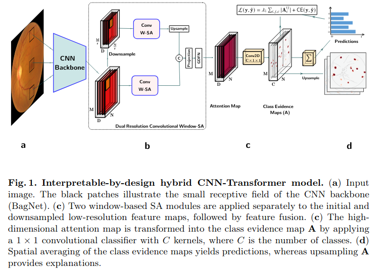

# An inherently-interpretable CNN-Transformer model for image classification
This repository contains the official implementation of the Self-Explainable CNN-Transformer architecture from the paper ["An inherently-interpretable CNN-Transformer model for image classification"](https://conferences.miccai.org/2025/en/default.asp) (Submitted to MICCAI 2025).

## Model's architecture


## Dependencies
All packages required for running the code in the repository are listed in the file `requirements.txt`

## Data
The code in this repository uses publicly available datasets for the [Diabetic Retinopathy Detection Challenge](https://www.kaggle.com/c/diabetic-retinopathy-detection/data) and the AREDS dataset which is available upon request and can be access from the [dbGaP repository](https://www.ncbi.nlm.nih.gov/projects/gap/cgi-bin/study.cgi?study_id=phs000001.v3.p1).

The Kaggle dataset was preprocessed by tightly cropping the circular mask of the retinal fundus and resize to 512 x 512. Then an ensemble of EfficientNets trained on the [ISBI2020 challenge dataset](https://isbi.deepdr.org/challenge2.html) was used to filter out images with low qualities. The resulting dataset (csv files) used for model training and evaluation are as follows: 
- [`training csv file`](./files/csv/kaggle/kaggle_gradable_train.csv)
- [`validation csv file`](./files/csv/kaggle/kaggle_gradable_val.csv)
- [`test csv file`](./files/csv/kaggle/kaggle_gradable_test.csv)

From the AREDS dataset, we used a subset with the highest-severity image per visit, and grouped AMD severity into six categories Early AMD, Moderate AMD, Advanced Intermediate AMD, Early Late AMD, Active Neovascular AMD, and End-Stage AMD. The resulting dataset (CSV files) used for model training and evaluation are as follows:
- [`test csv file`](./files/csv/Areds/test.csv) 
- [`training csv file`](./files/csv/Areds/train.csv)
- [`validation csv file`](./files/csv/val.csv)

The [IDRiD dataset](https://ieee-dataport.org/open-access/indian-diabetic-retinopathy-image-dataset-idrid) containing $81$ DR images with lesion annotations used to evaluate the model's explanation for DR detection is also publicly available. 

The images used for figures 2, and 4 are provided in `./files/images`

## How to use: Training
### 1. Organize the dataset as follows:
```
├── main_folder
    ├── AREDS_datset 
      ├── image1.png
      ├── image2.png
      ├── ...
    ├── Kaggle_dataset
      ├── image1.png
      ├── image2.png── ....
    ├── Outputs
      ├── ResNet-Transformer
      ├── BagNet-Transformer 
```

Then replace the values in  `configs/paths.yaml` according to your dataset, includind `root` and `main_folder`.

### 2. Update the training configurations and hyperparameters 
Update the training configurations and hyperparameters in: 

 `./configs/default.yaml`

### 3. Run to train
- Create a virtual environment and install dependencies 
```shell
$ pip install requirements.txt
```
- Run a model with previously defined parameters
```shell
$ python main.py
```

### 4. Monitor the training progress 
Monitor the training progress in website [127.0.0.1:6006](127.0.0.1:6006) by running:

```
$ tensorborad --logdir=/path/to/your/log --port=6006
```

## Reproducibility
Models weights and evaluation codes (figures 2, 3, and 4) are available upon request

### ResNet and dense BagNet code
We used code from the [interpretable-sparse-activation](https://github.com/kdjoumessi/interpretable-sparse-activation) repository to train both the ResNet-50 and dense-BagNet.

## Acknowledge
- This repository contains modified source code from [Hybrid-FPN-AACNet](https://github.com/zaidilyas89/Hybrid-FPN-AACNet) and [interpretable-sparse-activation](https://github.com/kdjoumessi/interpretable-sparse-activation)
- We greatly thanks the reviews of MICCAI 2025 for improving this work.

## Reference
```
@InProceedings{xxx,
        author = { Kerol Djoumessi, Samuel Ofosu Mensah, Philipp Berens},
        title = {An inherently-interpretable CNN-Transformer model for image classification},
        booktitle = {8th International Workshop on Interpretability of Machine Intelligence in Medical Image Computing (IMIMIC) at MICCAI},
        year = {2025}
}
```
